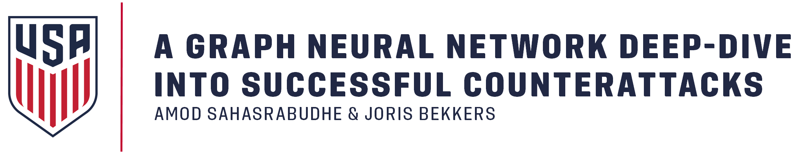
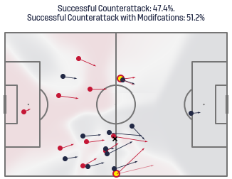
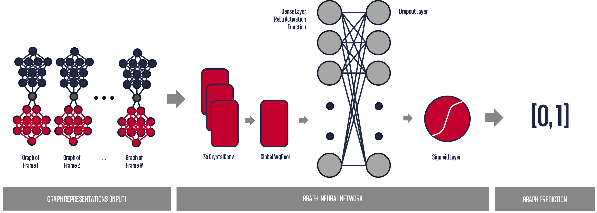
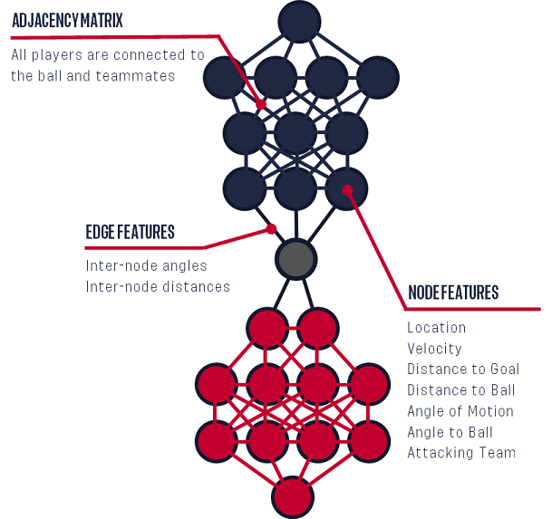

> ⚠️ **NOTE**: If you are having trouble automatically loading the data within Jupyter Notebook please find all relevant data files (and the associated paper) in the [Google Drive folder](https://drive.google.com/drive/folders/12F8B-AARr0otiYxE0Rvxbuckf6gjkqvE)


## MIT Sloan Sports Analytics Conference 2023 Research Repository 

This repository is provided alongside the paper: [_"A Graph Neural Network deep-dive into successful counterattacks"_](https://ussf-ssac-23-soccer-gnn.s3.us-east-2.amazonaws.com/public/Sahasrabudhe_Bekkers_SSAC23.pdf)[pdf] ([Mirror 1](https://drive.google.com/file/d/19IQbrHY-6AS7tJ7CnkcTORK8ztg5LVHa/view)). This paper is one of the finalists of the [2023 MIT Sloan Sports Analytics Conference Research Paper Competition](https://ussf-ssac-23-soccer-gnn.s3.us-east-2.amazonaws.com/public/Sahasrabudhe_Bekkers_SSAC23.pdf).
It contains an interactive [Python Jupyter Notebook](counterattack.ipynb) and all relevant datasets ([see below](#datasets)) for training GNNs using the [Spektral](https://graphneural.network/) library. 

## Authors
#### Amod Sahasrabudhe
[](https://www.linkedin.com/in/amod-sahasrabudhe/)
[](https://twitter.com/amod3598)

#### Joris Bekkers
[](https://www.linkedin.com/in/joris-bekkers-33138288/)
[](https://twitter.com/unravelsports)
[](https://unravelsports.github.io)

## Research Abstract
The purpose of this research is to build gender-specific, first-of-their-kind Graph Neural Networks to model the likelihood of a counterattack being successful
and to uncover what factors make them successful in both men's and women's professional soccer. 
These models are trained on a total of 20,863 frames of algorithmically identified counterattacking sequences from synchronized StatsPerform on-ball 
event and SkillCorner spatiotemporal (broadcast) tracking data. The [data](#datasets) - easily accessible within the [Counterattack Jupyter Notebook](counterattack.ipynb) - is derived from 632 games of MLS (2022), NWSL (2022) and international women’s soccer (2020-2022).


With this data we demonstrate that gender-specific Graph Neural Networks outperform architecturally identical gender-ambiguous models in predicting the successful outcome of 
counterattacks. We show, using Permutation Feature Importance, that byline to byline speed, angle to the goal, angle to the ball and sideline to sideline speed are the node
features with the highest impact on model performance.



## Presentation (YouTube)
Our MIT Sloan Sports Analytics Conference 2023 presentation has made its way to YouTube, see below:
[](https://www.youtube.com/watch?v=3ozD-fvQmOg)


## Model Architecture
The architecture of the GNN model provided in the [Counterattack Jupyter Notebook](counterattack.ipynb) is depicted in the image below


## Graph Configuration
Our preferred Graph configuration is depicted below. As you can see in [Counterattack Jupyter Notebook](counterattack.ipynb) you are free to choose your own configuration by selecting from an assortment of 
Adjaceny Matrices, Edge Features and Node Features, more on this [below](#Jupyter-Notebook)




## Installing Jupyter Notebook using pip:

  To install Jupyter using pip, first check if pip is updated in your system. Use the following command in the command prompt to update pip
    
  ```
  python -m pip install --upgrade pip
  ```

  Once upgraded, use the following command to install Jupyter
  ```
  python -m pip install jupyter
  ```
  
  Use the following command to launch Jupyter Notebook
  ```
  jupyter notebook
  ```
  
  Once launched, you should be able to see the following screen
  
  


## Installing the required Python libraries:
  Make sure the requirement.txt file is in the directory. Navigate to the directory using command prompt and type the following command
  ```
  pip install -r requirements.txt
  ```
Or for MacOS
```
  pip install -r requirements_macos.txt
  ```
## Jupyter Notebook
  * Navigate to the location where you have cloned the GitHub repository and open the interactive notebook.
  * Open the .ipynb file.
  * Run the first cell by clicking the play button or using the shortcut ```Shift + Enter``` through your keyboard. If all the libraries are installed succesffuly this code block should execute without throwing any errors.
  * Run the subsequent cell blocks to load the data.
  * Choose a file between men's data, women's data and combined dataset using the dropdown list.
    * Men's dataset - MLS 2022 season
    * Women's dataset - NWSL 2022 season + International Women's soccer
    * Combined dataset - Combination of both men and women's data
  * Choose the adjacency matrix from the dropdown list.
    * normal - connects attacking players amongst themselves, defensive players amongst themselves and the attacking and defending players are conencted through the ball.
    * delaunay - connects a few attacking players and defending players in a delaunay matrix fashion
    * dense - connects all the players and the ball to each other
    * dense_ap - connects all the attacking players to each other and defensive players.
    * dense_dp - connects all the defending players to each other and attacking players.
  
  * Choose the Edge features and Node Features using the checkboxes.
    * Edge Feature options:
      * Player Distance - Distance between two players connected to each other
      * Speed Difference - Speed difference between two players connected to each other
      * Positional Sine angle - Sine of the angle created between two players in the edge
      * Positional Cosine angle - Cosine of the angle created between two players in the edge
      * Velocity Sine angle - Sine of the angle created between the velocity vectors of two players in the edge
      * Velocity Cosine angle - Coine of the angle created between the velocity vectors of two players in the edge
      
    * Node Feature options:
      * x coordinate - x coordinate on the 2D pitch for the player / ball
      * y coordinate - y coordinate on the 2D pitch for the player / ball
      * vx - Velocity vector's x coordinate
      * vy - Velocity vector's y coordinate
      * Velocity - magnitude of the velocity
      *  Velocity Angle - angle made by the velocity vector
      * Distance to Goal - distance of the player from the goal post
      * Angle with Goal - angle made by the player with the goal
      * Distance to Ball - distance from the ball (always 0 for the ball)
      * Angle with Ball - angle made with the ball (always 0 for the ball)
      * Attacking Team Flag - 1 if the team is attacking, 0 if not and for the ball
      * Potential Receiver - 1 if player is a potential receiver, 0 otherwise
    
  * Update the graph neural training network configurations as per your requirement. You may also try chaning the network layers.
  * Start the model training. It should stop after the epochs are completed. Check your training logloss score. If it is not satisfactory rerun the training block.
  * Use the block for testing model logloss and ROC-AUC curve. 
  * Further, you may opt to look at model calibration and also calculate the Expected Calibration Error (More details in the notebook text blocks).
  * It is also possible to check which features contribute the most to the model performance. (**Note**: The ```Attacking Team Flag``` checkbox from the Node Features needs to be selected to calculate the feature importance.) Choose between attacking and defending players and note the differences via the box plot.

## Research Ideas
- Change the model architecture by introducing different configurations for the [Convolutional layers](https://graphneural.network/layers/convolution/), [Pooling layers](https://graphneural.network/layers/convolution/) and Hyper Parameters.
- Choose different adjacency matrices and different combinations of node features and edge features.
- Create a "Gender-Aware" model as suggested by [StatsBomb](https://statsbomb.com/articles/soccer/analytics-and-modelling-in-womens-football/). Perhaps this can be achieved by adding a node feature to each node in each graph specifying the gender.
- Use the [Imbalanced Dataset](#datasets) to build a robust (gendered) counterattacking success prediction model 
- Analyze the features and their importance to counterattack success more in-depth. This can help uncover for example, for which players on what position it is important to have a high (or low) `vx` etc.
- Analyze other aspects of counterattacks. For example: what is the impact of having more players behind the ball when defending, or how much is the impact of space reduction around the player on the ball.
- etc. 

## Citation

If you use any of the data or files within this repository, please cite our paper.

- [Google Scholar](https://scholar.google.com/citations?view_op=view_citation&hl=en&user=eerdAe8AAAAJ&citation_for_view=eerdAe8AAAAJ:d1gkVwhDpl0C)

```text
@inproceedings{sahasrabudhe2023graph,
  title={A Graph Neural Network deep-dive into successful counterattacks},
  author={Sahasrabudhe, Amod and Bekkers, Joris},
  booktitle={17th Annual MIT Sloan Sports Analytics Conference. Boston, MA, USA: MIT},
  pages={15},
  year={2023}
}
```

## Datasets

We provide two different types of datasets:

### 1. Event Frames Only Balanced Dataset
This dataset is used within our research paper. It contains only Graph representations of tracking data frames that are associated with an event that happens
within a counterattacking sequence. 
#### Samples:
| Dataset  | Competitions                                                    | Sample Size  <br/>(Individual Graphs) |
|----------|-----------------------------------------------------------------|---------------------------------------|
| Women    | NWSL (2022) <br/>Int. Friendlies <br/>SheBelieves <br/>Olympics | 3,720                                 |
| Men      | MLS (2022)                                                      | 17,143                                |
| Combined | All                                                             | 20,863                                |
#### Labels:
Every Graph of an event that is part of a counterattacking sequence where eventually the ball reaches the opposing team's penalty area is labeled a success (1).
#### Balance:
This dataset has 50% successful and 50% unsuccessful labels.
#### Structure:

```text
{
  "normal": {
    "a": [AdjMatrixGraph0, AdjMatrixGraph1, ... AdjMatrixGraphN],
    "x": [NodeFeatureMatrixGraph0, NodeFeatureMatrixGraph1, ... NodeFeatureMatrixGraphNN],
    "e": [EdgeFeatureMatrixGraph0, EdgeFeatureMatrixGraph1, ... EdgeFeatureMatrixGraphN]
  }, <- similar dictionaries for each other Adjacency Matrix Type ("delaunay", "dense", "dense_ap", "dense_dp")
  "binary": [[LabelGraph0], [LabelGraph1]...[LabelGraphN]]
}
```
The data loading process is automated within the [Counterattack Jupyter Notebook](counterattack.ipynb), but it can also be obtained through the links below.

- [Counterattacks Women](https://ussf-ssac-23-soccer-gnn.s3.us-east-2.amazonaws.com/public/counterattack/women.pkl)
- [Counterattacks Men](https://ussf-ssac-23-soccer-gnn.s3.us-east-2.amazonaws.com/public/counterattack/men.pkl)
- [Counterattacks Combined](https://ussf-ssac-23-soccer-gnn.s3.us-east-2.amazonaws.com/public/counterattack/combined.pkl)

_Note: Node and Edge feature names for these datasets are listed in [Counterattack Jupyter Notebook](counterattack.ipynb)_

### 2. Full Frames Imbalanced Dataset
This dataset is an _additional_ dataset that was **not** used within the research paper. 
It contains Graph representations of every tracking data frame that is associated with a counterattacking sequence. 

#### Samples:
| Dataset  | Competitions                                                    | Sample Size <br/>(Individual Graphs) |
|----------|-----------------------------------------------------------------|--------------------------------------|
| Women    | NWSL (2022) <br/>Int. Friendlies <br/>SheBelieves <br/>Olympics | 103,381                              |
| Men      | MLS (2022, approx. 32% of games)                                | 104,628                              |
#### Labels:
Every Graph frame that is part of a counterattacking sequence that leads to a goal is labeled a success (1).
#### Balance:
This dataset has approx. 5% successful and approx. 95% unsuccessful labels.
#### Structure:
The structure is slightly different, as we only provide the `normal` adjacency matrix. 

We also provide an `id` label. This label number is the same for all frames that belong to the same sequence.
Use this Sequence ID value to split the test & train data such that we do not add parts of a single sequence to both the test and train set.
Doing this would result in leaking information between test and train set. To do this splitting see [split_sequences.py](split_sequences.py). 
```text
{
  "a": [AdjMatrixGraph0, AdjMatrixGraph1, ... AdjMatrixGraphN],
  "x": [NodeFeatureMatrixGraph0, NodeFeatureMatrixGraph1, ... NodeFeatureMatrixGraphNN],
  "e": [EdgeFeatureMatrixGraph0, EdgeFeatureMatrixGraph1, ... EdgeFeatureMatrixGraphN]
  "label": [[LabelGraph0], [LabelGraph1]...[LabelGraphN]],
  "id": [SequenceIDGraph0, SequenceIDGraph1, ... SequenceIDGraphN],
  "node_feature_names": ["x", "y", "vx",... "att_team"], 
  "edge_feature_names": ["distance", ...]
}
```
- [Counterattacks Women Imbalanced All Frames](https://ussf-ssac-23-soccer-gnn.s3.us-east-2.amazonaws.com/public/counterattack/women_imbalanced.pkl)
- [Counterattacks Men Imbalanced All Frames](https://ussf-ssac-23-soccer-gnn.s3.us-east-2.amazonaws.com/public/counterattack/men_imbalanced.pkl)

## Requirements

- Python 3.9+
