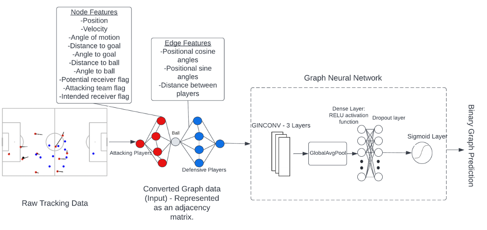

# A Graph Neural Network deep-dive into successful counterattacks

## 1. Introduction
A counterattack in soccer is a high speed, high intensity direct attack that can occur when a team transitions from a defensive state to an attacking state after regaining possession of the ball. 
The aim is to create a goal-scoring opportunity by covering a lot of ground with minimal passes before the opposing team can recover their defensive shape.  
The purpose of this research is to build state-of-the-art Graph Neural Networks (GNN), using synced StatsPerform event and SkillCorner spatiotemporal (broadcast) tracking data from the 2022 Major League Soccer (MLS) 
and National Women Soccer League (NWSL) seasons, to calculate the likelihood of a counterattack being successful, and to determine what factors make a counterattack a success in both the men’s and women’s game. 

## 2. Methods
The counterattacks are first algorithmically identified and labeled successful or unsuccessful following a set of event data driven rules comprised and verified in 
collaboration with USWNT and USMNT Performance Analysts. Subsequently, these labels are applied to each individual frame of spatiotemporal tracking data.

Each individual frame is then converted into a graph representation consisting of an adjacency-, an edge feature-, and a node feature matrix.
These matrices are then fed into a GNN architecture that is constructed with Pythons’ spektral library. The architecture (shown in Figure 1) consists of 3 GINConv layers, 
a Global Average Pool layer, a Dense Layer with ReLu activation, a Dropout layer and ultimately a Sigmoid activation function.  
 
The GNN is trained on a balanced training set – 50% successful, 50% unsuccessful – for both the men’s and women’s data. For output stabilization the nodes are weighted in the loss computation. 

## 3. Results
The model achieves an ROC-AUC of 0.88 as well as a log-loss of 0.354, beating the baseline log-loss of 0.693 by a wide margin. 
The models feature importance is determined using Permutation Feature Importance. This method breaks the relationship between individual features and the true result by applying a permutation to the feature’s values.
This allows us to identify the importance of each individual feature by measuring the increase in prediction error.
Figure 2 shows which node and edge features had the biggest increase in prediction error and are therefore the most important features for predicting a successful counterattack.

## 4. Conclusions
We show how complex state-of-the-art Graph Neural Networks combined with Permutation Feature Importance can help digest and analyze vast amounts of counterattacks,
and perhaps other segments of play, and aid in determining what makes them successful or not. This can subsequently help coaches and (performance) analysts to identify 
opportunities for strategic and tactical improvement in both counterattacking and defending counterattacks, at scale and individually, even at the highest levels of play.

------

### Requirements

- Python 3.9+
- spektral==1.2.0

-----

### References

- [Spektral GitHub Repository](https://github.com/danielegrattarola/spektral)